

###### Θεόδωρος Συμεωνίδης 1064870
###### Τωμαδάκης Θεόδωρος 1047073
---

# Μη υλοποιημένες λειτουργίες

* Εξαγωγή δεδομένων σε τύπο CSV

---

# Ενδεικτικές τεχνολογίες που χρησιμοποιήθηκαν

* NodeJS

## Back-end

* ExpressJS
* MongoDB
* Mongoose

---

# Ενδεικτικές τεχνολογίες που χρησιμοποιήθηκαν

* NodeJS

## Front-end

* ReactJS
* Turf.js
* Leaflet.js
* Chart.js
* Axios

---

# Καταμερισμός εργασίας

#### Από κοινού σχεδιασμός front-end και back-end

## Θεόδωρος Συμεωνίδης
* Υλοποίηση front-end 

## Θεόδωρος Τωμαδάκης
* Yλοποίηση back-end

---

# Διαχειριστής

1. Dashboard
2. Απεικόνιση στοιχείων σε χάρτη
3. Διαγραφή δεδομένων
4. Εξαγωγή δεδομένων

---

# 1. Dashboard

---

## 1.a-b Ποσοστό εγγραφών ανά τύπο δραστηριότητας/χρήστη

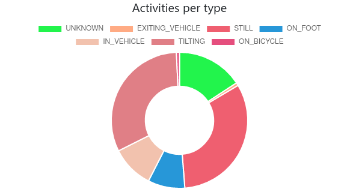 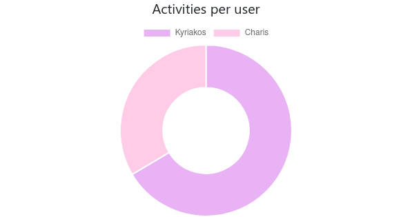

---

## 1.c-d Πλήθος εγγραφών ανά χρόνο/μήνα

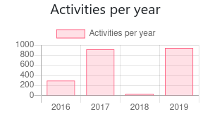 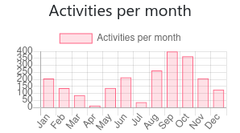

---

## 1.e-f Πλήθος εγγραφών ανά ημέρα/ώρα

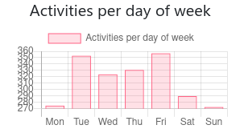 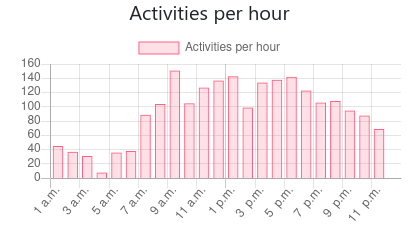

---

# 2. Απεικόνιση στοιχείων σε χάρτη

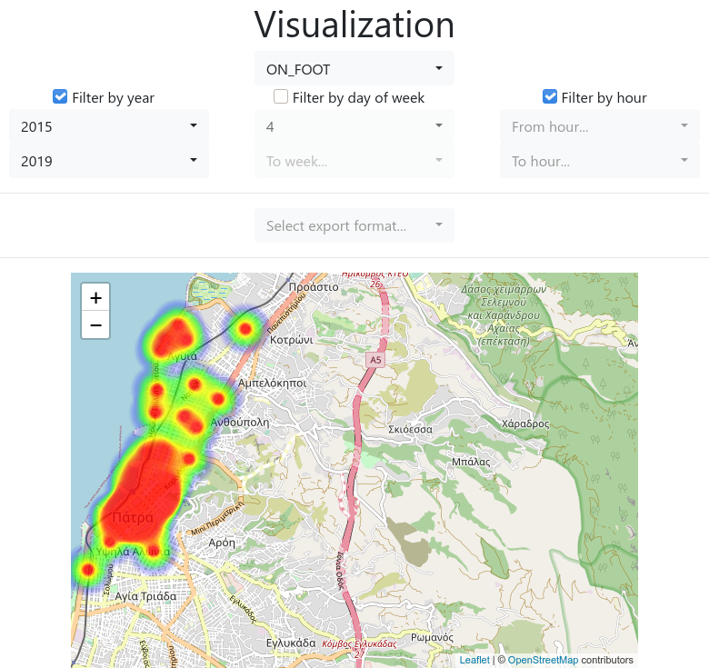

---

# 3. Διαγραφή δεδομένων

---

# 3. Διαγραφή δεδομένων

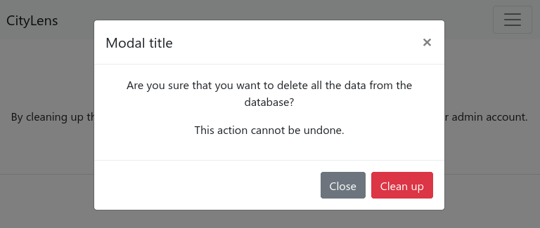

---

# 4. Εξαγωγή δεδομένων

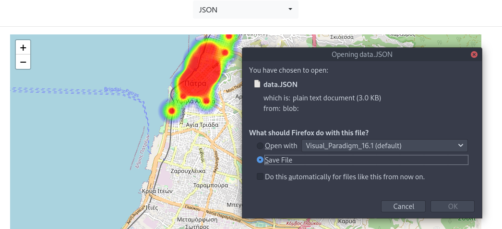

---

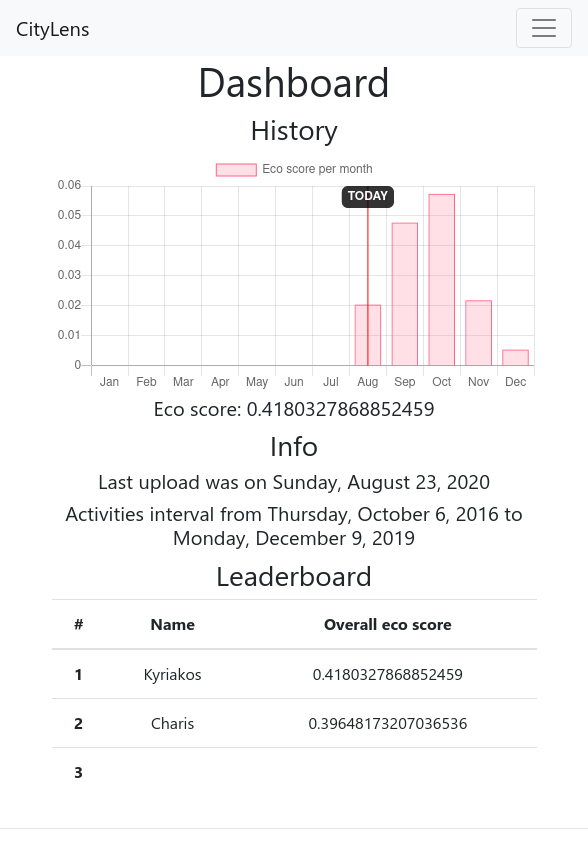

# Χρήστης
1. Εγγραφή στο σύστημα
2. Απεικόνιση στοιχείων χρήστη
3. Ανάλυση στοιχείων χρήστη
4. Upload δεδομένων

---

# 1. Εγγραφή στο σύστημα

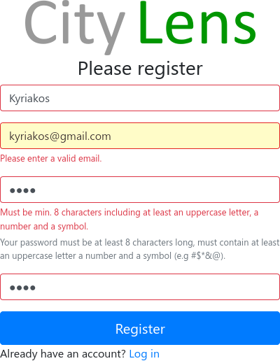

---

# 2. Απεικόνιση στοιχείων χρήστη

---

## 2.a-b Score οικολογικής μετακίνησης, ιστορικό score οικολογικής μετακίνησης

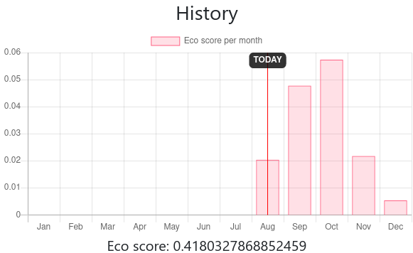

--- 

## 2.b-c Ημερομηνία τελευταίου upload, περίοδος που καλύπτουν οι εγγραφές

---

## 2.d Leaderboard

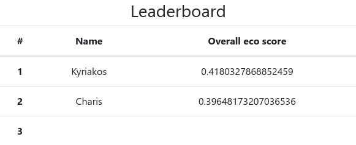

---

# 3. Ανάλυση στοιχείων χρήστη

---

## 3.a Ποσοστό εγγραφών ανά είδος δραστηριότητας

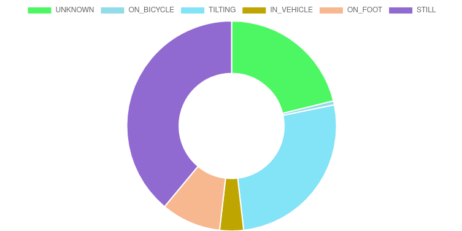

---

## 3.b Ώρα της ημέρας με τις περισσότερες εγγραφές ανά είδος δραστηριότητας

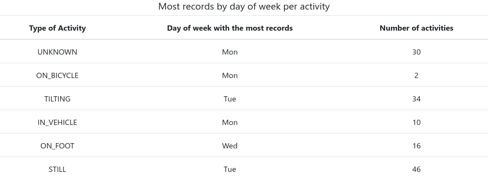

---

## 3.c Ώρα της ημέρας με τις περισσότερες εγγραφές ανά είδος δραστηριότητας

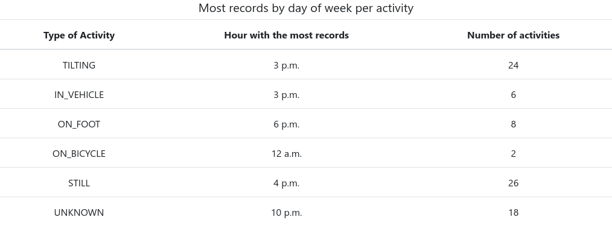

---

# 4. Upload δεδομένων

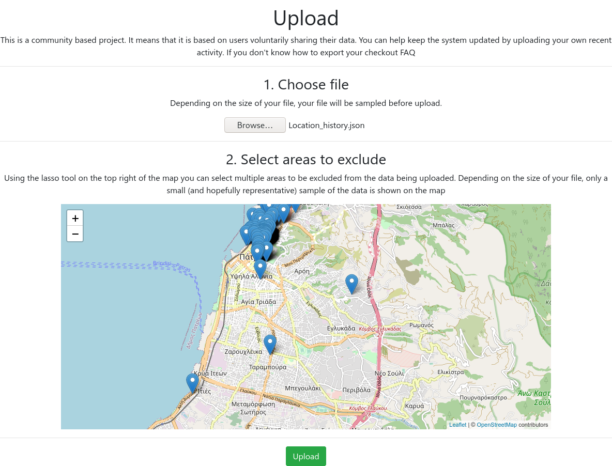

---

# Επιπλέον

---

## FAQ

---

## Είσοδος

---

# Τέλος

##### created with [@marp][marp-vscode]

[marp-vscode]: https://github.com/marp-team/marp-vscode
